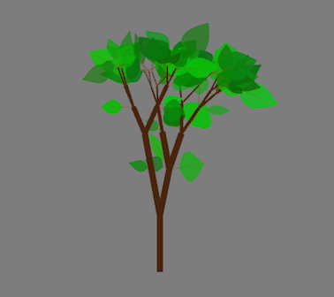

#Test Repo Readme

lfjas;dlfha s;dlfh as

 f;asdjhf ;asdlihf as'd
 a sdf;jhas d;fh asd;fh 
 
 
 
##Header 2

* asdf
* asdf
* [OpenBCI's Learning Page](http://docs.openbci.com/tutorials/01-GettingStarted#getting-started-w-openbci-i-what-you-need-3-your-electrode-starter-kit-esk-or-other-electrodes)
* asdf
* asdf
	* asdf
	* asdf 
* asdf

**asdf**

[link](http://)

* asdf

`

class Leaf {
    
public:
    
    void setup(float _branchAngle, int _season);
    void update();
    void draw(float _xPos, float _yPos);
    
    // stuff pertaining to each instance of the Leaf class
private:
    
    ofColor stemColor;
    ofColor leafColor;
    float xPos, yPos;
    float scaleFactor;
    float rotation;
    
    float stemLength, stemWidth;
    float leafLength, leafWidth;
    float leafCurvature;
    
    float randomNumber;
    int season;
    
};

`

###Header 3